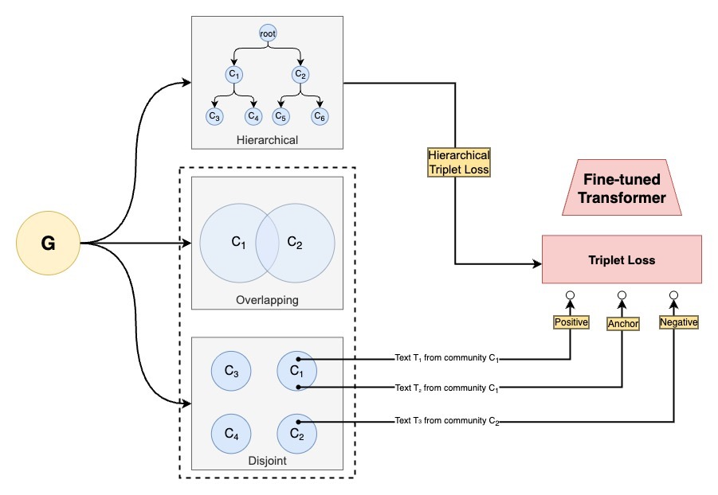

# CAT

CAT (Community Augmented Transformers) uses an alternative fine tuning method to 'augment' encoder-only transformers with network community structural information, without the use of an explicit GNN architecture.



## Approach

CAT has two steps:

1. Standard fine tuning
2. Contrastive community learning

### Standard fine tuning

Traditionally, BERT models use masked-token prediction to learn embeddings. This would generally be the case for this step of the fine tuning process. This step is essentially to start with a base fine tuning method, then in a later step use CAT's actual logic to enhance the embedding.

### Constrastive community learning

In this part, depending on the type of clustering, we use contrastive learning to distinguish pairs that might be part of same of different communities:

- **(D-CAT) disjoint/overlapping**: select metadata of two nodes belonging to the same community, then select a node belonging to a different community, then use triplet loss
- **(H-CAT) hierarchical**: select metadata from 3 nodes $u,v,w$ such that given their leaf to leaf (l2l) distance, $l2l(u,v)<l2l(u,w)$ and $l2l(u,v)<l2l(v,w)$ then use hierarchical triplet loss.

Selection is done via uniform random sampling given the above constraints.

## Project Structure

```
cat/
├── README.md
├── LICENSE
├── requirements.txt
├── .gitignore
│
├── assets/
│   └── cat_diagram.png
│
├── hcat/                         (Hierarchical CAT - Main Module)
│   ├── model.py                    (TripletEmbeddingModel)
│   ├── dataset.py                  (HierarchicalTripletDataset)
│   ├── tree_utils.py               (HierarchicalTree, TreeNode)
│   ├── losses.py                   (Hierarchical Loss Functions)
│   ├── trainer.py                  (Training & Eval Utilities)
│   ├── train.py                    (Core Training Functions)
│   ├── notebook_utils.py           (Utilities for Notebooks)
│   │
│   └── experiments/              (Notebooks for SciBERT H-CAT Training)
│       ├── hierarchical_fine_tuning_scibert.ipynb
│       ├── hierarchical_fine_tuning_aml_scibert.ipynb
│       └── results/
│
├── dcat/                         (Disjoint CAT - Alternative Approach)
│   └── experiments/
│       └── disjoint_fine_tuning.ipynb
│
├── utils/                        (Graph Clustering Algos & Eval)
│   ├── clustering/
│   │   ├── leiden.py
│   │   ├── upgma.py
│   │   └── paris.py
│   │
│   └── evaluation/
│       └── link_prediction.py
│
├── experiments/                  (MedCPT Experiments & Eval)
│   ├── medcpt_cat_tune.ipynb
│   └── evaluation_scripts.ipynb
│
└── data/                           (untracked)
```
